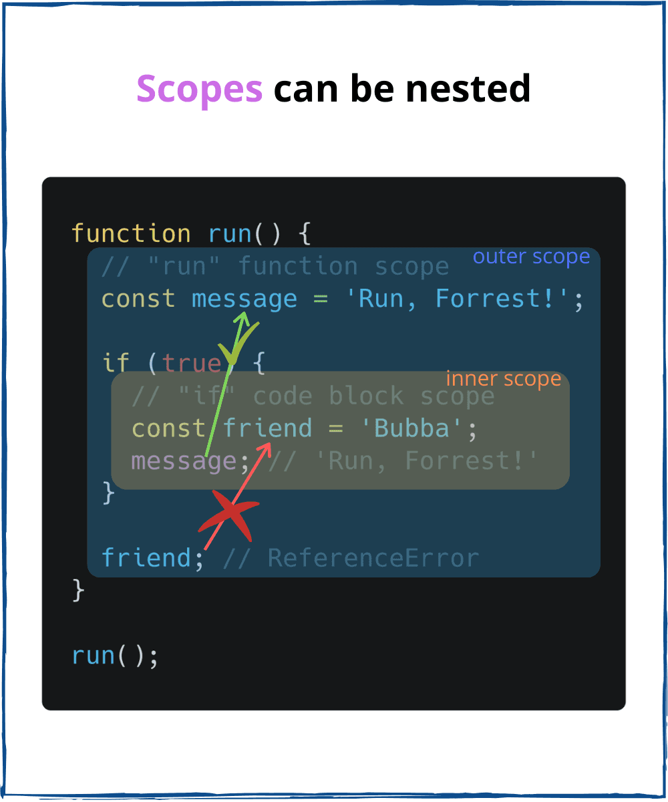

# Lecture2-April
# Homework
## _What is a scope in js ?_


### The scope is the current context of execution in which values and expressions are "visible" or can be referenced. If a variable or expression is not in the current scope, it will not be available for use. Scopes can also be layered in a hierarchy, so that child scopes have access to parent scopes, but not vice versa.


# `JavaScript has the following kinds of scopes:`

## _`Global scope`_


#### *The default scope for all code running in script mode.* 
```
let globalVariable = "some value"
console.log(globalVariable) // some value
```


## _`Function scope`_

* #### The scope created with a `function`.
```
function multiply() {
    let one = 1
    var two = 2
    const three = 3
 
    return one * two * three
}
 
// Variable shadowing
const three = 'three' // Does not throw an error
```


## _Block scope_

* #### This scope restricts the variable that is declared inside a specific block, from access by the outside of the block.
```
{ // Beginning of block
    const one = '1'
    let two = '2'
    var three = '3'
} // End of block
 
console.log(one) // throws error
 
console.log(three) // "3"
```

## _Module scope_

* #### The `Null` type is inhabited by exactly one value: `null`

----------------------------------------------------------------------------


## _`Hoisting in java script`_


### Hoisting is a JavaScript mechanism where variables and function declarations are moved to the top of their scope before code execution.


## _`Hoisting – Variable (var)`_
.png)
* #### There’s a temptation to think that all of the code you see in a JavaScript program is interpreted line-by-line, top-down in order, as the program execute. While that is essentially true, there’s one part of that as‐assumption that can lead to incorrect thinking about your program.


```
x = 5;
var a;
console.log(a);
```


## _`Hoisting – function declaration`_

* #### Function hoisting only works with function declarations — not with function expressions. 
```
console.log(square(5)); // 25

function square(n) {
  return n * n;
}
```


## _`Temporal dead zone, let and const`_

* #### `Temporal Dead Zone` is the period of time during which the let and const declarations cannot be accessed.
```
console.log(x); // ReferenceError
const x = 3;

console.log(y); // ReferenceError
let y = 3;
```

